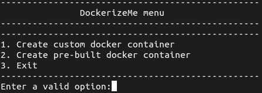
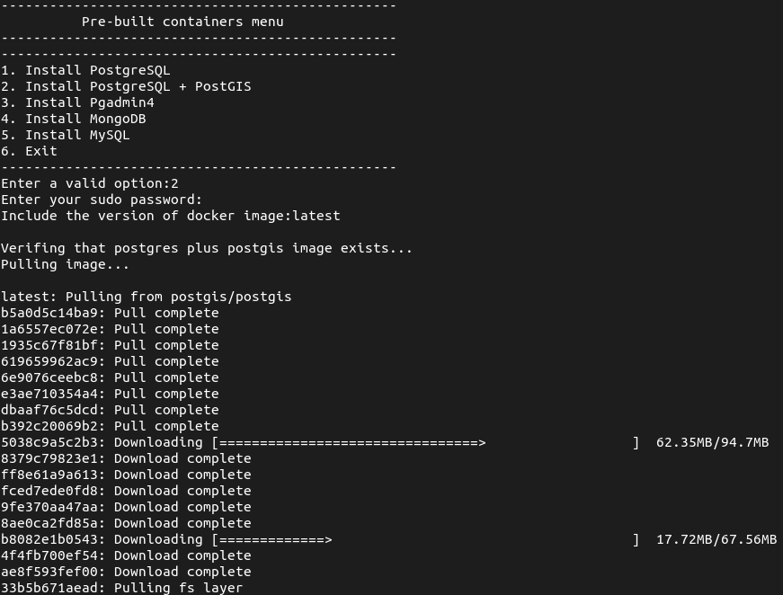

# DockerizeMe

<p align="center"></p>
 
**_DockerizeMe_** this bash script allows you to create docker containers with ease, specifying environment variables, volumes, and other parameters.

# Table of content

- [DockerizeMe](#dockerizeme)
- [Screenshots](#screenshots)
- [Tech Stack](#tech-stack)
- [Installation](#installation)
- [Usage](#usage)
  - [Port mappings](#port-mappings)
  - [Environment variables](#environment-variables)
  - [Volumes](#volumes)
  - [Prebuilt containers](#prebuilt-containers)
    - [Supported services](#supported-services)
- [Comments](#comments)
- [License](#license)
- [Authors](#authors)

# Screenshots



# Tech Stack

- **Bash**

- **Git** 

- **Docker**

# Installation

To install this project, clone it from github with the following

**shell**

```
git clone https://github.com/christophermontero/dockerizeme.git
cd dockerizeme
```

# Usage

To use this project, run the following command:

**shell**

```
./dockerizeme.sh
```

## Port mappings

When prompted for port mappings, use the following format:

**shell**

```
8080:8080,... (add more as needed)
```

## Environment variables

When prompted for environment variables, use the following format:

**shell**

```
VAR_NAME=value,... (add more as needed)
```

## Volumes

If you want to attach volume to the container, type 'yes' when prompted, and it will be located in `$HOME/docker-vol/image-name`

## Prebuilt containers

DockerizeMe provides a range of pre-built containers designed to streamline the setup of commonly used database and application services. These pre-configured containers make it effortless to get your desired services up and running quickly.

### Supported Services

Here is a list of services supported by this script:

- **PostgreSQL**
  - PostgreSQL with PostGIS extension
- **MongoDB**
- **MySQL**
- **PgAdmin4**

Choose from these services to simplify your containerization process and accelerate your development workflow.

# Comments

If you have any feedback, please reach out at cgortizm21@gmail.com

# License

This project is under [Apache 2.0 License](https://www.apache.org/licenses/LICENSE-2.0)

# Authors

- [@christophermontero](https://github.com/christophermontero)

